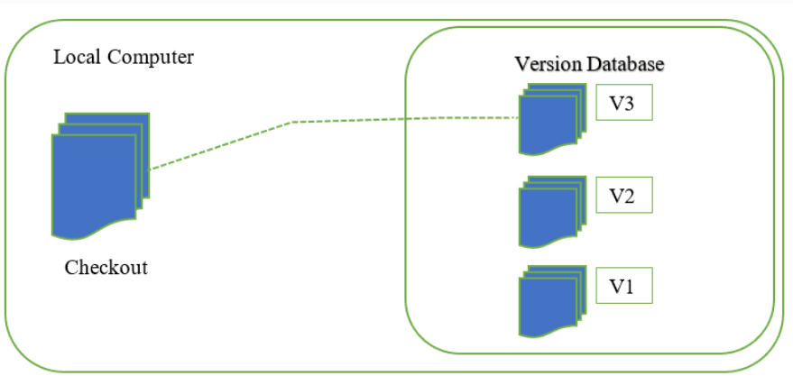
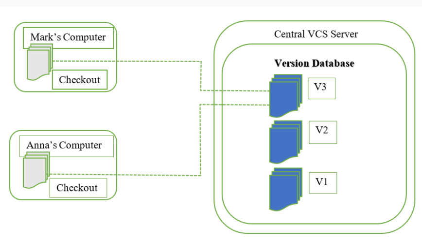
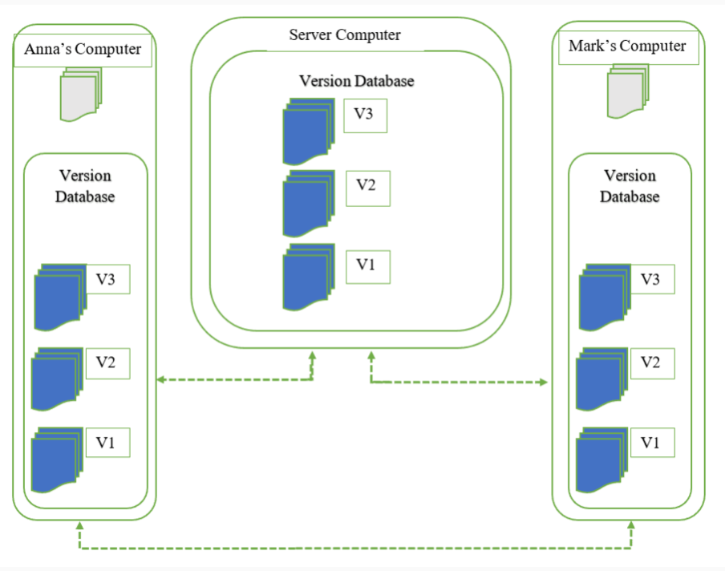
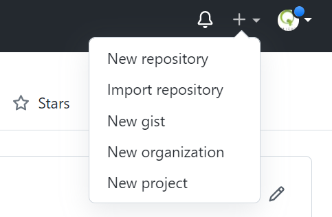
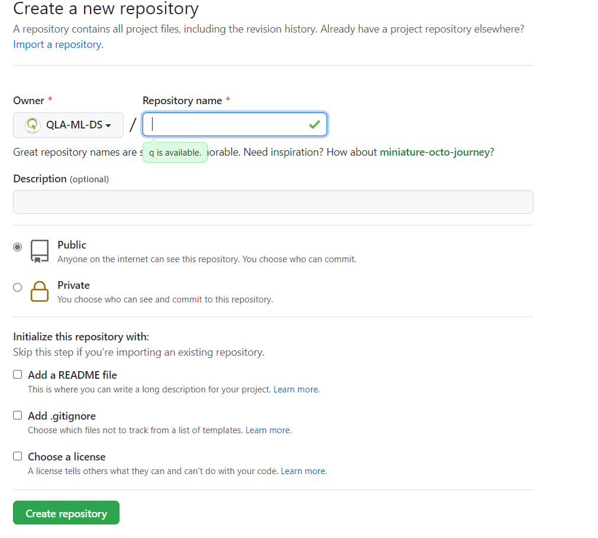
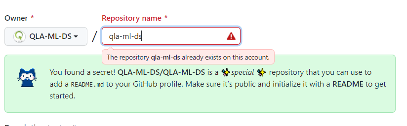
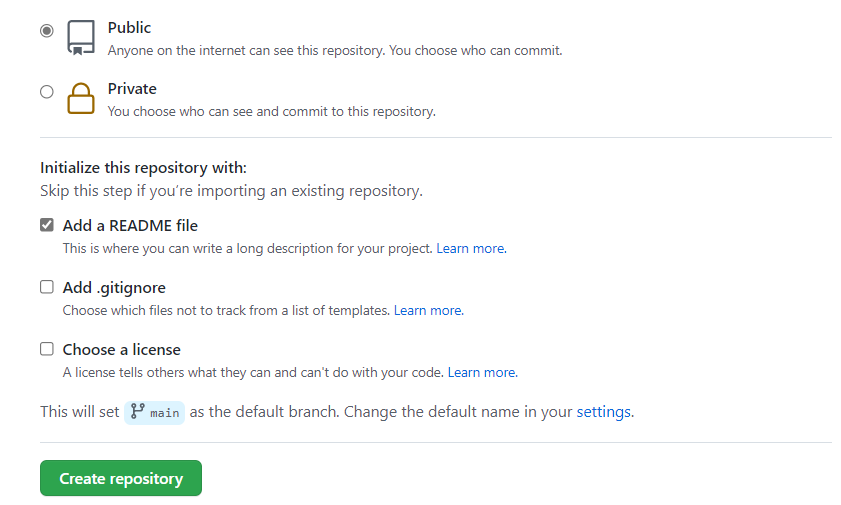
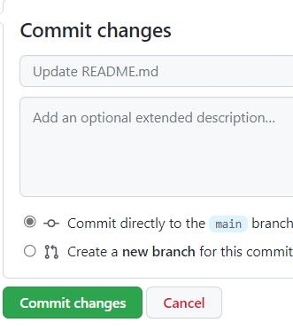

<center>
  <a href="https://quantumleapafrica.org/" > </a>
 </center>
 
    
# <center> <b> <span style="color:orange;" >  `Version Control with Git (VCG) ` </span> </b></center>


## <center> <b> <span style="color:orange;"> Efficient remote collaboration </span> </b></center>


# Local Version Control

A local version control system is a local database located on your local computer, in which every file change is stored as a patch. Every patch set contains only the changes made to the file since its last version. In order to see what the file looked like at any given moment, it is necessary to add up all the relevant patches to the file in order until that given moment.

<center>
  <a href="https://serengetitech.com/tech/introduction-to-git-and-types-of-version-control-systems/" > </a>
 </center>


The main problem with this is that everything is stored locally. If anything were to happen to the local database, all the patches would be lost. If anything were to happen to a single version, all the changes made after that version would be lost.
Also, collaborating with other developers or a team is very hard or nearly impossible.


## `git` : What is Version Control ? 

In a few words, **version control** is a way to keep a backup of the changes in your files and to store a history of those changes.  The key charateristic of **VC** is that and it allows many people in a collaboration to make changes to the same files concurrently. **VC** is done via a **VC system** and there are a lot of them. [Wikipedia](https://en.wikipedia.org/wiki/Version_control) provides both a nice vocabulary list and a fairly complete table of some
popular version control systems and their equivalent commands.

We'll be using git. `Git` is an example of a [**distributed version control system**](https://en.wikipedia.org/wiki/Distributed_version_control#:~:text=From%20Wikipedia%2C%20the%20free%20encyclopedia%20In%20software%20development%2C,full%20history%2C%20is%20mirrored%20on%20every%20developer%27s%20computer.), distinct from [**centralized versing control systems**](https://pediaa.com/what-is-the-difference-between-centralized-and-distributed-version-control/#:~:text=What%20is%20Centralized%20Version%20Control%20In%20centralized%20version,those%20changes%20get%20saved%20in%20the%20central%20server.). I'll not discuss the distinction, but for now, the table below will
suffice.

Version Control System Tool Options


- **Centralized**
  - concurrent versions system (cvs)
  - subversion (svn)
  
  <center>
  <a href="https://serengetitech.com/tech/introduction-to-git-and-types-of-version-control-systems/" > </a>
 </center>


- **Distributed** 
  - Decentralized CVS (dcvs)  
  - mercurial (hg)
  - git (git). `Git` is the most well-known example of distributed version control systems.
  - bazaar (bzr)
  
  <center>
  <a href="https://serengetitech.com/tech/introduction-to-git-and-types-of-version-control-systems/" > </a>
 </center>
 
 
 
 
**Note:**  A centralized version control system has a single server that contains all the file versions. This enables multiple clients to simultaneously access files on the server, pull them to their local computer or push them onto the server from their local computer. This allows for easy collaboration with other developers or a team. The biggest issue with this structure is that everything is stored on the centralized server. If something were to happen to that server, nobody can save their versioned changes, pull files or collaborate at all. With distributed version control systems, clients don’t just check out the latest snapshot of the files from the server, they fully mirror the repository, including its full history. Thus, everyone collaborating on a project owns a local copy of the whole project, i.e. owns their own local database with their own complete history. With this model, if the server becomes unavailable or dies, any of the client repositories can send a copy of the project's version to any other client or back onto the server when it becomes available.

## The Command Line
There are a lot of different ways to use Git. There are the original command line tools, and there are many graphical
user interfaces of varying capabilities. For this book, we will be using Git on the command line. For one, the
command line is the only place you can run all Git commands – most of the GUIs only implement some subset of Git
functionality for simplicity. If you know how to run the command line version, you can probably also figure out how to
run the GUI version, while the opposite is not necessarily true. So we will expect you to know how to open Terminal in Linux, Mac or Command Prompt or Powershell in Windows. If you don’t know what we’re talking about here, you might to read [command line for Windows users](https://www.ionos.com/digitalguide/server/know-how/windows-cmd-commands/), or  [command line for Mac users](https://www.taniarascia.com/how-to-use-the-command-line-for-apple-macos-and-linux/) or [command line for Linux users](https://ubuntu.com/tutorials/command-line-for-beginners#3-opening-a-terminal).

For this tutorial, we will be using the terminal in Linux and Windows. 

## Installing Git

Before you start using Git, you have to make it available on your computer. Even if it’s already installed, it’s probably a
good idea to update to the latest version. You can either install it as a package or via another installer, or download the
source code and compile it yourself.

### Installing on Linux
If you want to install Git on Linux via a binary installer, you can generally do so through the basic packagemanagement tool that comes with your distribution. If you’re on a `Debian-based` distribution like `Ubuntu`, try `apt-get`:

```bash
$ sudo apt-get install git
```
For more options, there are instructions for installing on several different Unix flavors on the Git website, at [git for Linux](http://git-scm.com/download/linux).

### Installing on Mac
There are several ways to install Git on a Mac. An Git installer is
maintained and available for download at the Git website at  [git for Mac](http://git-scm.com/download/mac).

### Installing on Windows
There are also a few ways to install Git on Windows. The most official build is available for download on the Git
website, just go to [git for Windows](http://git-scm.com/download/win).


## First-Time Git Setup
Now that you have Git on your system, you’ll want to do a few things to customize your Git environment. You should
have to do these things only once on any given computer; they’ll stick around between upgrades. You can also change
them at any time by running through the commands again.

### Your Identity:  `git config`
The first thing you should do when you install Git is to set your user name and e-mail address. This is important
because every Git commit uses this information, and it’s immutably baked into the commits you start creating. A few settings are in order. You don't have to do it now but it is recommanded.

```bash
$ git config --global user.name "<your-name>"
$ git config --global user.email "<your-email-address>"
```     


### Your Editor
Now that your identity is set up, you can configure the default text editor that will be used when Git needs you to type in a message. 
##### `Linux` & `Windows`
```bash
$ git config --global core.editor gedit
```

#####  `Windows`
```bash
> git config --global core.editor notepad
```

If not configured, Git uses your system’s default editor, which is generally `vim` or `vi` for Linux users and `notepad` for Windows users. If you want to use a different text editor, such as `xyz`, you can do the following:

##### `Linux` & `Windows`
```bash
$/>  git config --global core.editor xyz
```


##### Checking Your Settings
If you want to check your settings, you can use the `git config --list` command to list all the settings Git can find at
that point:

```bash
$ git config --list
user.name= your-name
user.email=your-email-address
color.status=auto
color.branch=auto
color.interactive=auto
color.diff=auto
...
```

You can also check what `git` thinks a specific key's value is by typing `git config <key>`:

```bash
$ git config user.name
your-name
```

## git --help : Getting Help

The first thing you should know about any **tool** is how to get **help**. From the command line type

##### Linux
```bash
$ man git
```

##### Windows
```bash
> HELP git
```


If you remember, **man** tells you more about a command and how to use it (in Linux) while the corresponding command for Windows is **HELP**. The manual entry for the git version control system will appear before you. You may scroll through it using arrows, or you can search for
keywords by typing **/** followed by the search term. I'm interested in help, so I type **/help** and then hit enter. It looks like the syntax for getting help with git is **git --help**.

Let's see what happens when we type :

```bash
$ git --help
```

Excellent, it gives a list of commands it is able to help with, as well
as their descriptions.

```bash
$ git --help
usage: git [--version] [--exec-path[=<path>]] [--html-path]
           [-p|--paginate|--no-pager] [--no-replace-objects]
           [--bare] [--git-dir=<path>] [--work-tree=<path>]
           [-c name=value] [--help]
           <command> [<args>]

The most commonly used git commands are:
   add        Add file contents to the index
   bisect     Find by binary search the change that introduced a bug
   branch     List, create, or delete branches
   checkout   Checkout a branch or paths to the working tree
   clone      Clone a repository into a new directory
   commit     Record changes to the repository
   diff       Show changes between commits, commit and working tree, etc
   fetch      Download objects and refs from another repository
   grep       Print lines matching a pattern
   init       Create an empty git repository or reinitialize an existing one
   log        Show commit logs
   merge      Join two or more development histories together
   mv         Move or rename a file, a directory, or a symlink
   pull       Fetch from and merge with another repository or a local branch
   push       Update remote refs along with associated objects
   rebase     Forward-port local commits to the updated upstream head
   reset      Reset current HEAD to the specified state
   rm         Remove files from the working tree and from the index
   show       Show various types of objects
   status     Show the working tree status
   tag        Create, list, delete or verify a tag object signed with GPG

See 'git help <command>' for more information on a specific command.
```

# Git Basics

## Getting a Git Repository
You can get a Git project using two main approaches. The first takes an existing project or directory and imports it into
Git. The second clones an existing Git repository from another server and will be discussed another day.

### git init : Creating a Local Repository

To keep track of numerous versions of your work without saving numerous copies, you can make a local repository for it on your computer. What git does is to save the first version, then for each subsequent version it saves only the changes. This is the trick, git only records the difference between the new version and the one before it. With this compact information,
git is able to recreate any version on demand by adding the changes to the original in order up to the version of interest.

To create your own local (on your own machine) repository, you must initialize the repository with the infrastructure git needs in order to keep a record of things within the repository that you're concerned
about. If you’re starting to track an existing project in Git, you need to go to the project’s directory and type **git init**.

* * * * 
### Practical : Create a Local Repository

Step 1 : Initialize your repository. Navigate to `/home`

```bash
$ cd
$ mkdir simplestats
$ cd simplestats
$ git init
Initialized empty Git repository in /home/me/simplestats/.git/
```

Step 2 : Browse the directory's hidden files to see what happened here.
Open directories, browse file contents. Learn what you can in a minute.

```bash
$ ls -A
.git
$ cd .git
$ ls -A
HEAD        config      description hooks       info        objects     refs      branches
```

Step 3 : Use what you've learned. You may have noticed the file called
description. You can describe your repository by opening the description
file and replacing the text with a name for the repository.  We will be
creating a module with some simple statistical methods, so mine will be
called "Some simple methods for statistical analysis". You may call yours 
anything you like.

```bash
$ nano description
```
    
* * * *

* * *  *
#### Checking the Status of Your Files
The main tool you use to determine which files are in which state is the `git status` command. If you run this
command directly after a clone, you should see something like this:

```bash
$ git status
On branch master

No commits yet

nothing to commit (create/copy files and use "git add" to track)
```

* * *  *


#### Tracking New Files
In order to begin tracking a new file, you use the command `git add`. For the git repository to know which files within this directory you would like to keep track of, you must add them. First, you'll need to
create one, then we'll learn the **git add** command.

* * * * 
### Practical : Add a File to Your Local Repository

Step 1 : Create a file to add to your repository.

```bash
$ touch README.md
```

Step 2: Verify that git has seen the ne file.

```bash
$ git status
# On branch master

# No commits yet

# Untracked files:
  #(use "git add <file>..." to include in what will be committed)
	README.md

# nothing added to commit but untracked files present (use "git add" to track)
```


Step 3 : Inform git that you would like to keep track of future changes
in this file.

```bash
$ git add README.md
```

```bash
$ git status
# On branch master
#
# Initial commit
#
# Changes to be committed:
#   (use "git rm --cached <file>..." to unstage)
#
#       new file:   README.md
#
```
* * * * 

#### Staging Modified Files


The files you've created on your machine are your local "working" copy. The changes your make in this local copy aren't backed up online automatically. Until you commit them, the changes you make are local changes. When you change anything, your set of files becomes different from the files in the official repository copy. Let’s change a file that was already tracked. Modify the content of `README.md` and then run your `git status` command again.

* * * 
### Practical : Commit Your Changes

Step 1 : Commit the file you've added to your repository.

    $ git commit -am "This is the first commit. It adds a readme file."
    [master (root-commit) 1863aef] This is the first commit. It adds a readme file.
     1 files changed, 2 insertions(+), 0 deletions(-)
     create mode 100644 README.md

Step 2 : Admire your work.

    $ git status
    # On branch master
    nothing to commit (working directory clean)
* * * 

The null result means that you're up to date with the current version of the repository online. This result indicates that the current difference between the repository HEAD (which, so far, is empty) and your `simplestats` directory is this new README.md file.

### Create an Online Git Repository

[GitHub](https://github.com/signup?ref_cta=Sign+up&ref_loc=header+logged+out&ref_page=%2F&source=header-home) is the most popular location to host repositories, so go ahead and make an account there. 
Then I'll assume your username is `you`. This would make your new GitHub account `github.com/you`. 


#### Setting your public profile

Once you've made your account, create a repository by clicking Add `New repository`. 
 
 
 <center>
  <a href="https://docs.github.com/en/repositories" > </a>
 </center>


You will be prompted to a page like this:


 <center>
  <a href="https://docs.github.com/en/repositories" > </a>
 </center>


Now, put  `you` as your repository name:


<center>
  <a href="https://docs.github.com/en/repositories" > </a>
 </center>


On the picture, the warning appears because this repository already exists for my account. Then make sure you tick `Public` and `Add a README file` and click on `Create repository`.


<center>
  <a href="https://docs.github.com/en/repositories" > </a>
 </center>


You will then be redirected to a page like this:


<center>
  <a href="https://docs.github.com/en/repositories" > </a>
 </center>


Click on the pen at the top right, edit your profile and make sure to click on `Commit changes`:


<center>
  <a href="https://docs.github.com/en/repositories" > </a>
 </center>
 


#### Connecting a local repo to a remote one: guided tour

1. Create a repository by clicking `Add New Repo`. Do not initialize with a `README`at this point. We can call the repository `project`. Your repository has been created at `github.com/you/project`. It should be completely empty.


2. On yout local machine (your computer), from the command line, create a new folder called `project-local`
```bash
$ mkdir project-local
```

3. Move into the newly created directory
```bash
$ cd project-local
```
Now you're in the folder where your local project and Git repository will live. From here, we will begin using git commands.


4. Then move on and initialize Git repository.
```bash
$ git init
```
Initialized empty Git repository in `/Users/you/project-local/.git/` Great! Now you have an empty Git repo on your local computer.


5. Hook up local directory with the repo we made at github.com.
```bash
$ git remote add origin https://github.com/you/project
```

Terminal won't respond, but it was successful. Go ahead and add a file to the `project-local` directory. You can add as many files as you want, but I will assume you added two files - `index.html` and `style.css`.


6. Check the status of your local repository.
```bash
$ git status
```
`On branch master Initial commit Untracked files: (use "git add ..." to include in what will be committed) index.html style.css nothing added to commit but untracked files present (use "git add" to track)`


Okay, so now it knows that there are two files in the directory, but they're not a part of the Git repo. At this point we have to track the files with the `add` command, which adds all files to the repo.


7. 
```bash
$ git add .
```


8. Let's check the status again with 
```bash
$ git status
```
`On branch master Initial commit Changes to be committed: (use "git rm --cached ..." to unstage) new file: index.html new file: style.css`

9. Commit tracked files to the master branch
```bash
$ git commit -am "Initial Commit"
```
`[master (root-commit)] Initial 2 files changed, 34 insertions(+) create mode index.html create mode style.css`

10. Push the files to the Git repo at github.com.
```bash
$ git push origin master
```


Terminal will prompt you to enter your GitHub username and password. When you type in your password, it might not show that you've typed anything, but it's being entered.

Now refresh your GitHub page. Success! All your files are now hosted at Github.com!

# <center> <b> <span style="color:orange;" >  ` Beyond the scope of this tutorial ` </span> </b></center>

## git commit : Saving a Snapshot

In order to save a snapshot of the current state (revision) of the
repository, we use the commit command. This command is always associated
with a message describing the changes since the last commit and
indicating their purpose. Informative commit messages will serve you
well someday, so make a habit of never committing changes without at
least a full sentence description.

**ADVICE: Commit often**

In the same way that it is wise to often save a document that you are
working on, so too is it wise to save numerous revisions of your code.
More frequent commits increase the granularity of your **undo** button.

**ADVICE: Good commit messages**

There are no hard and fast rules, but good commits are atomic: they are the smallest change that remain meaningful. A good commit message usually contains a one-line description followed by a longer explanation if necessary.


## git diff : Viewing the Differences

There are many diff tools.

If you have a favorite you can set your default git diff tool to execute
that one. Git, however, comes with its own diff system.

Let's recall the behavior of the diff command on the command line.
Choosing two files that are similar, the command :

    $ diff file1 file2

will output the lines that differ between the two files. This
information can be saved as what's known as a patch, but we won't go
deeply into that just now.

The only difference between the command line diff tool and git's diff
tool is that the git tool is aware of all of the revisions in your
repository, allowing each revision of each file to be treated as a full
file.

Thus, git diff will output the changes in your working directory that
are not yet staged for a commit. To see how this works, make a change in
your README.md file, but don't yet commit it.

    $ git diff

A summarized version of this output can be output with the --stat flag :

    $ git diff --stat

To see only the differences in a certain path, try:

    $ git diff HEAD -- [path]

To see what IS staged for commit (that is, what will be committed if you
type git commit without the -a flag), you can try :

    $ git diff --cached

## git log : Viewing the History

A log of the commit messages is kept by the repository and can be
reviewed with the log command.

    $ git log
    commit 1863aefd7db752f58226264e5f4282bda641ddb3
    Author: Joshua Smith <joshua.r.smith@gmail.com>
    Date:   Wed Feb 8 16:08:08 2012 -0600

        This is the first commit. It adds a readme file.

There are some useful flags for this command, such as

    -p
    -3
    --stat
    --oneline
    --graph
    --pretty=short/full/fuller/oneline
    --since=X.minutes/hours/days/weeks/months/years or YY-MM-DD-HH:MM
    --until=X.minutes/hours/days/weeks/months/years or YY-MM-DD-HH:MM
    --author=<pattern>

## git reset : Unstaging a staged file

There are a number of ways that you may accidentally stage a file that
you don't want to commit.  Create a file called `temp_notes` that
describes what you had for breakfast, and then add that file to your
repo.  Check with `status` to see that it is added but not committed.

You can now unstage that file with:

```bash
$ git reset temp_notes
```

Check with `status`.

## git checkout : Discarding unstaged modifications (git checkout has other purposes)

Perhaps you have made a number of changes that you realize are not
going anywhere.  Add a line to `README.md` that describes your dinner
last night.  Check with `status` to see that the file is changed and
ready to be added.

You can now return to previous checked in version with:

    $ git checkout -- README.md

Check with `status` and take a look at the file.

## git rm : Removing files

There are a variety of reasons you way want to remove a file from the
repository after it has been committed.  Create a file called
`READYOU.md` with the first names of all your immediate family
members, and add/commit it to the repository.

You can now remove the file from the repository with:

    git rm READYOU.md

List the directory to see that you have no file named `READYOU.md`.
Use `status` to determine if you need any additional steps.

What if you delete a file in the shell without `git rm`? Try deleting
`README.md`

     rm README.md

What does `git status` say?  Oops! How can you recover this important
file?

     git checkout -- README.md


## git revert : the promised "undo" button

It is possible that after many commits, you decide that you really
want to "rollback" a set of commits and start over.  It is easy to
revert your code to a previous version.

You can use `git log` and `git diff` to explore your history and
determine which version you are interested in.  Choose a version and
note the *hash* for that version. (Let's assume `abc456`)

     git revert abc456

**Importantly,** this will not erase the intervening commits.  This
will create a new commit that is changed from the previous commit by a
change that will recreate the desired version.  This retains a
complete provenance of your software, and be compared to the
prohibition in removing pages from a lab notebook.

* * * *
### Exercise :

1. Create 5 files in your directory with one line of content in each
   file.
2. Commit the files to the repository.
3. Change 2 of the 5 files and commit them.
4. Undo the changes in step 3.
5. Print out the last entry in the log.
    
* * * *

## Resources

1. [git book](http://git-scm.com/book) - Free and Open
